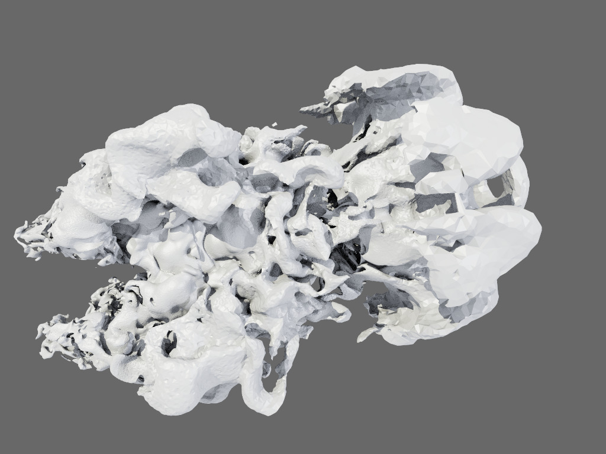

# umesh: A Little Library for Managing and Manipulating Unstructured Mesh Data

# Motivation

In several of our recent unstructure-mesh rendering projects we ended
spending significant amounts of time on wrangling data sets for
testing and profiling the actual rendering codes. The most obvious
such data-wrangling task is importing from a variety of formats, but
others include tetrahedralizing, computing the (unstructured) dual
mesh of an AMR data set, computing outer shell (the outside facing
triangles), computing inner face connectivity, merging different
meshes or partitioning them into spatial partitions, etc.

In order to not re-invent the wheel for every new such project, the
goal of this library is to "bundle" all such common operations in a
easy-to-use library that other projects can then use as a git
subproject - providing a single place of contact for adding new
functionality, fixing bugs, etc. The visualization toolkit (VTK)
obviously has much of all that, too (if you already use VTK and are
happy with it, keep on using it!), but comes with certain dependencies
and learning requirements that this library tries to avoid.

The overall design is to have a single base class for unstructured
meshes ("UMesh") that can hold vertices, tetrahedra, pyramids, wedges,
and general hexahedra (as well as triangles and quads, as such data
sets reuquire!), plus some per-vertex scalar field, if required; and
to offer both C++ library functions as well tiny command-line
interface tools to manipulate such meshes. 

The overall goal of umesh is to provide ease of use and code
maintenance, not necessarily utmost performance.

# Dependencies

- a C++-11 capable compiler
- CUDA (will be made optional at some point in time)
- OWL, as a submodule (will be made optional at some point in time; all we need is the
  owl::common vector library for vec3fs, and owl::parallel_for constructs)
- optional: TBB (will parallelize some routines; will run scalar w/o TBB)

# The Central umesh::UMesh class

The central call of this library is the 'UMesh' class, that stores

- a array of vertex positions, in vec3f (3 x float32) format

- a (optional) array of per-vertex scalar values, in float32s

- one array each for tets (four floats), pyramids (five floats),
  wedges (six), and hexahedra (eight); each type of elemnt is store in
  a separate std::vector of that type, and may or may not be empty
  (ie, a tet-only mesh is simply one in which on the tets[] vector is
  used). 
  
Vertex ordering for the unstructured elements is the same one as
sketched in the `windingorder.jpg` file; though to be clear some input
file formats are inconsistent on winding order.

# Specific Tools / Functionality

## `tetrahedralize` a umesh

Given a umesh with any combination of tets,
pyramids, wedges, and/or hexes, create a new umesh that contains
only tetrahedra, in a way such that any elements sharing a face will
also end up with properly shared tet-faces after the
tetrahedralization (using the method described in
https://ingowald.blog/2020/10/06/tetrahedralize-umesh/). 

Available in library form via `UMesh::SP tetrahedralize(UMesh::SP
mesh)` in `umesh/tetrahedralize.h`

Available as CLI tool via `./umeshTetrahedralize -o tetsOnly_out.umesh generalMesh.umesh`

Notes:

- tetrahedralizing a mesh that's already a tet mesh will emit a
  warning, but *will* create a new mesh (that will contain the same
  tets, but with possibly different vertex order)

- also comes in a second variant where the input comes with additional
  info on which of its elements are owned elements vs ghost cells, and
  where the output contains only the tetrahedralized version of the
  owned cells, but with the same vertex array af if also the ghost
  cells had been tessellated, too.

## Extract Iso-Surface

Runs a (parallel) iso-surface extration algorithm, and constucts a new
umesh containing only triangles for the chosen ios-surface value.

Notes: 

- Algorithm is parallelized, and pretty fast, but may use quite some
  memory during extraction.

- for the CLI tool you can choose whether to emit an OBJ file with the
  surface, of a ".umesh" file with a umesh that contains only triangles.
  
- algorithm can hnadle both tet and general unstructured meshes.

Also available programmatically via `umesh::extractIsoSurface(mesh, isoValue)`.

Example:

    ./umeshExtractIsoSurface /space/lander-small-rho-9000.umesh \
	--obj iso.obj --iso 0.2
	
should produce an obj file that looks like this (ca 19M tris, rendered w/ ospray):



## Compute Shared-Face Connectivity

## Compute Outer Shell

## Perform Object-Space Partitioning

## Perform Spatial Partitioning


# Importers

UMesh can load the following formats:

## umesh binary format (".umesh")

our own binary format

## ugrid32/ugrid64

the ugrid64 and ugrid32 formats used by various versions of NASA's
fun3d library.

## Nasa Fun3D Mars Lander importer

importer tools to download, and import the different files from the
"NASA Mars Lander Retropulsion Study" data release, strip ghost
cells, and merge them into a single unstructured mesh umesh file.

    ./umeshImportLanderFun3D /space/fun3d/small/geometry/dAgpu0145_Fa_me \
	--scalars /space/fun3d/small/10000unsteadyiters/dAgpu0145_Fa_volume_data. \
	-o /space/lander-small-rho-9000.umesh  -ts 9000 -var rho

This should Should import the "small" (148M vertex) version of the lander, time step 9000, and variable rho. This should result in a file with the following info

```
wald@trinity:~/Projects/umesh/bin$ ./umeshInfo /space/lander-small-rho-9000.umesh 
loading umesh from /space/lander-small-rho-9000.umesh
UMesh info:
#verts : 144.89M
#tris  : 0
#quads : 0
#tets  : 766.42M
#pyrs  : 47.45K
#wedges: 31.99M
#hexes : 0
bounds : [(-300,-100,-100):(300,100,100)]
values : [0:96.9123]
```


## OFF

pretty old, OBJ-like format (most famously, the jets dataset)

